# Software Engineering Lab — Practical File

**Course:** CIC-357, Software Engineering Lab, 5th Semester
**Institution:** Vivekananda School of Engineering & Technology, VIPS-TC
**Student:** Hardik

**Project used for all experiments:**
*Token-Accounting Integrity in LLM Metering: A Systematic Study of Client-Side Under-Payment*

---

## Note on evidence labelling

Every artefact below is drawn from the existing research repository. Nothing has been
invented for this lab file. Each item is labelled:

| Label | Meaning |
|---|---|
| **IMPLEMENTED** | Exists as running code in the repository |
| **MODEL-LEVEL** | Exists only in the TLA+ formal specification |
| **EXPERIMENTAL** | Exists only as an experiment runner or measured result |

Where the lab manual asks for something the research testbed genuinely does not contain,
this is stated plainly rather than filled with a fabricated example.

---
---

# Experiment 1

## Aim
Write down the problem statement for a suggested system of relevance.

## Apparatus / Software Requirements
Text editor; the project repository.

## Theory
A problem statement defines the gap a system addresses, its scope, and the conditions
under which it is considered solved. It precedes requirements analysis and constrains
every later artefact.

## Problem Statement

Large Language Model (LLM) APIs are billed per token. The billed quantity is not known
when a request is authorised — it is produced at runtime by the model — and value reaches
the client progressively as output streams, while the accounting record is still open.
This makes the metering and accounting path a security boundary rather than a
bookkeeping detail.

Published security work on this boundary assumes the *client* is honest. It studies
dishonest providers inflating token counts, third parties draining a victim's budget, and
dishonest intermediaries forging routing claims. The inverse case — an honest provider
facing a legitimate, authenticated client that wants inference without paying for it — has
no taxonomy, no measurement, and no defence evaluation.

**The problem:** determine whether a dishonest client can obtain metered LLM inference
while under-paying, identify the architectural conditions under which this is possible,
and establish which server-side enforcement primitives remove it.

**The system built to study it** is a vulnerable-by-construction LLM-SaaS testbed: a
FastAPI metering gateway over PostgreSQL and Redis, with paired vulnerable and hardened
implementations of each metering architecture, an attack harness, defence reference
implementations, a TLA+ specification of the request lifecycle, and experiment runners
that measure leakage.

**Scope.** Three failure dimensions are studied:

- **B0** — state synchronisation (non-atomic check-then-decrement on a credit balance).
  A known baseline, used to validate the measurement rig.
- **M1** — commitment timing (when the charge is committed relative to value delivery).
- **M2** — usage authority (which representation of usage the billing decision reads).

**Out of scope.** The behaviour, robustness, or output safety of the language model
itself. No commercial provider is tested; all experiments run against the local testbed.

**Success criterion.** For every served request, the value delivered must not exceed the
net amount charged — the accounting-integrity property `V(r) ≤ N(r)`.

## Output / Result
A bounded, testable problem statement with an explicit safety property, three named
failure dimensions, and stated scope exclusions.

## Learning Outcome
Learned to convert an open research question into a problem statement with a falsifiable
success criterion, and to state exclusions explicitly so that scope cannot drift.

## Precautions / Assumptions
- The problem is stated for a *testbed*, not for any named commercial service.
- B0 is declared a known baseline, not a contribution; overstating it would misrepresent
  the work.

---
---

# Experiment 2

## Aim
Do requirement analysis and develop a Software Requirement Specification (SRS) for the
system.

## Apparatus / Software Requirements
Text editor; repository source (`app/`, `experiments/`, `formal/`).

## Theory
An SRS records what a system must do (functional requirements) and the qualities it must
exhibit (non-functional requirements), without prescribing implementation.

## SRS

### 2.1 Purpose
Specify the requirements of the token-accounting integrity testbed: a metered LLM
inference gateway built so that individual accounting flaws can be switched on and off
and measured under controlled conditions.

### 2.2 Scope
The system serves metered completion requests, records usage, commits charges, and exposes
administrative control so experiments can select an architecture, run trials, and audit
results. It is a research instrument, not a production billing service.

### 2.3 Users / Actors

| Actor | Description |
|---|---|
| Honest Client | Requests inference and pays the correct amount. Control condition. |
| Dishonest Client | Attempts to obtain inference while under-paying (attack harness). |
| Experimenter | Configures posture/architecture, runs trials, retrieves audits. |
| Inference Backend | Produces tokens — deterministic mock generator, or a real llama.cpp server. |
| Accounting Worker | Applies deferred usage events in the asynchronous backend. |

### 2.4 Functional Requirements

| ID | Requirement | Status |
|---|---|---|
| FR-1 | Serve a metered completion request and stream output | IMPLEMENTED (`/complete`, `/m1/stream`) |
| FR-2 | Authorise a request against the account balance before serving | IMPLEMENTED (`app/metering/debit.py`) |
| FR-3 | Compute usage as a multi-category token vector | IMPLEMENTED (`app/accounting/usage.py`) |
| FR-4 | Price usage by a category-sensitive pricing function | IMPLEMENTED (`app/metering/pricing.py`) |
| FR-5 | Commit a debit to the account balance | IMPLEMENTED (`app/accounting/backends.py`) |
| FR-6 | Record each served request in an auditable usage ledger | IMPLEMENTED (`usage_records`, `ledger_entries`) |
| FR-7 | Switch flaw-class posture (vulnerable/hardened) at runtime without restart | IMPLEMENTED (`POST /admin/config`) |
| FR-8 | Select the commit-timing architecture per trial | IMPLEMENTED (`app/architectures/commit_timing.py`) |
| FR-9 | Select the usage-authority architecture per trial | IMPLEMENTED (`app/architectures/usage_authority.py`) |
| FR-10 | Create, finalise and audit a measurement trial | IMPLEMENTED (`/admin/trials`, `/admin/m-trials`) |
| FR-11 | Re-derive leakage independently and fail loudly on disagreement | IMPLEMENTED (integrity gate in summarisers) |
| FR-12 | Apply usage events asynchronously via a worker | IMPLEMENTED (`app/accounting/async_worker.py`) |
| FR-13 | Substitute a real serving stack for the mock generator | IMPLEMENTED (`app/llm/real_server.py`) |

### 2.5 Non-Functional Requirements

| ID | Requirement |
|---|---|
| NFR-1 | **Determinism** — experiments must be repeatable; seeds and configuration are recorded with every trial. |
| NFR-2 | **Auditability** — every trial stores before/after balances so leakage is derivable two independent ways. |
| NFR-3 | **Reproducibility on commodity hardware** — no GPU required; the mock generator is the default backend. |
| NFR-4 | **Fail-closed integrity gates** — a reconciliation mismatch aborts the run rather than being reported. |
| NFR-5 | **Structural separation** — vulnerable and hardened paths are separate code paths, not one branch on a flag. |

### 2.6 Security Requirements

| ID | Requirement |
|---|---|
| SR-1 | **Accounting integrity** — for every served request, delivered value ≤ net charge (`V(r) ≤ N(r)`). |
| SR-2 | **Solvency** — the account balance must never go negative. |
| SR-3 | **Ledger conservation** — the sum of net debits must equal the change in balance. |
| SR-4 | **Bounded refund** — a refund must never exceed the reservation minus value delivered. |
| SR-5 | **Server-authoritative billing** — the billing decision must read a server-computed usage value, not a client-declared one. |

SR-1 to SR-4 are the four invariants checked in the TLA+ model (MODEL-LEVEL) and by the
programmatic gates in the experiment summarisers (IMPLEMENTED).

### 2.7 Operating Environment
Python 3.11+; FastAPI/uvicorn; PostgreSQL 16 (READ COMMITTED); Redis 7; Docker Compose;
optional llama.cpp with SmolLM2-135M-Instruct for real-serving validation. Developed and
measured on a laptop-class machine (i5-13450HX, 16 GB RAM). GPU not required.

### 2.8 Constraints
- All attacks target only the local testbed; no third-party or production system.
- Deferred-settlement delays are injected, not observed in production.
- The formal model is finite and checks safety properties only.

### 2.9 Assumptions
- The provider is honest; only the client is adversarial.
- The client is authenticated and legitimate — this is under-payment, not intrusion.
- Mock pricing values are chosen so a request cost is exactly representable in
  `NUMERIC(18,6)`.

## Output / Result
An SRS with 13 functional, 5 non-functional and 5 security requirements, each traceable to
a file in the repository or to the formal model.

## Learning Outcome
Learned to separate functional from non-functional and security requirements, and to make
requirements traceable to implementation artefacts rather than aspirational.

## Precautions / Assumptions
Requirements were extracted from existing code. No requirement was written for
functionality the testbed does not have.

---
---

# Experiment 3

## Aim
Perform the function-oriented analysis: Data Flow Diagram (DFD) and Structured Chart.

## Apparatus / Software Requirements
StarUML / Mermaid; repository source.

## Theory
A DFD models a system as processes transforming data flows between external entities and
data stores. A structured chart shows the hierarchical decomposition of modules.

## 3.1 DFD Level 0 (Context Diagram)

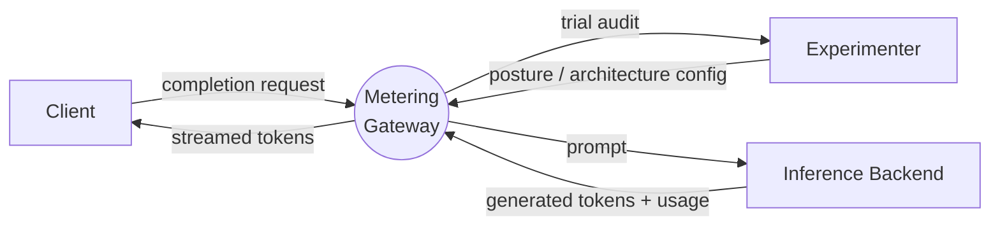

## 3.2 DFD Level 1

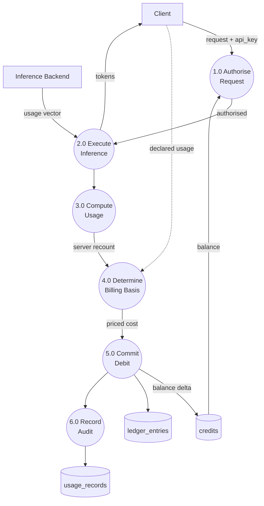

The dashed flow into process 4.0 is the M2 failure surface: when the billing basis reads
the client-declared usage instead of the server recount, leakage occurs even though 3.0
computed the correct value.

## 3.3 Structured Chart

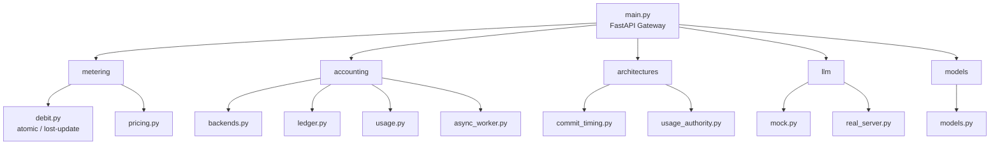

## Output / Result
A context diagram, a level-1 DFD locating the M2 failure surface at the billing-basis
process, and a structured chart matching the actual module tree under `app/`.

## Learning Outcome
Learned that a DFD can localise a security flaw to a specific process: the defect is not
in usage computation (3.0) but in which input the billing decision (4.0) reads.

## Precautions / Assumptions
Module names in the structured chart are the real filenames. No module was added for
diagram symmetry.

---
---

# Experiment 4

## Aim
Draw the Entity-Relationship diagram for the system.

## Apparatus / Software Requirements
StarUML / Mermaid; `app/models/models.py`.

## Theory
An ER diagram models persistent entities, their attributes, and the relationships between
them.

## Project-specific work

The testbed uses seven real SQLAlchemy-mapped tables. These are the actual entities — none
has been invented for this diagram.

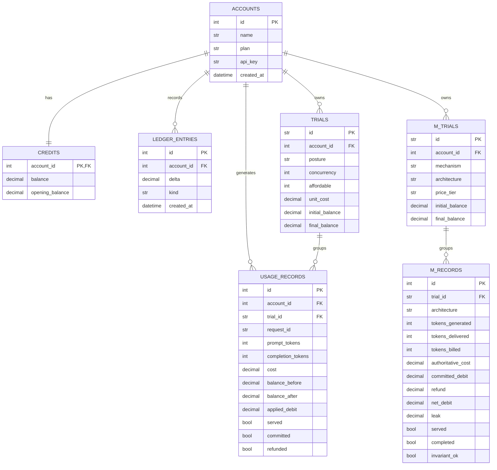

**Why the schema looks like this.** `USAGE_RECORDS` stores `balance_before`,
`balance_after` and `applied_debit` alongside the intended `cost` specifically so leakage
can be derived two independent ways — `initial − final`, and `SUM(applied_debit)` — and
the two must reconcile. `M_RECORDS` separates `tokens_generated`, `tokens_delivered` and
`tokens_billed` because the whole M2 result depends on those three being able to disagree.

## Output / Result
A seven-entity ER diagram taken directly from the ORM definitions, with the audit columns
that make the integrity gate possible.

## Learning Outcome
Learned that schema design can encode a verification requirement: storing both the
intended and the applied debit is what allows an independent recomputation to falsify the
server's own arithmetic.

## Precautions / Assumptions
`detection_level` exists as a column in `m_records` but the associated detectability claim
was **withdrawn** after an internal audit. The column is retained for historical
reproducibility and carries no scientific claim.

---
---

# Experiment 5

## Aim
Perform the user's view analysis: Use Case diagram.

## Apparatus / Software Requirements
StarUML / Mermaid; API route definitions in `app/`.

## Theory
A use case diagram shows actors and the externally visible functions they invoke.

## Project-specific work

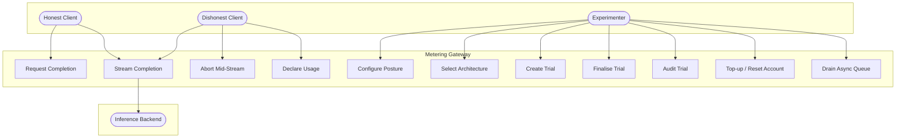

**Actor–use case mapping to real endpoints:**

| Use case | Endpoint | Actor |
|---|---|---|
| Request Completion | `POST /complete` | Honest / Dishonest Client |
| Stream Completion | `POST /m1/stream` | Honest / Dishonest Client |
| Abort Mid-Stream | client disconnect during `/m1/stream` | Dishonest Client |
| Declare Usage | `POST /m2/complete` | Dishonest Client |
| Configure Posture | `POST /admin/config` | Experimenter |
| Create / Finalise / Audit Trial | `/admin/trials`, `/admin/m-trials/*` | Experimenter |
| Drain Async Queue | `POST /admin/async/drain` | Experimenter |

*Abort Mid-Stream* is not a separate endpoint — it is the client closing the connection
during a streaming response. It is listed as a use case because it is the M1 attack.

## Output / Result
A use case diagram with three human actors, one system actor, and eleven use cases, each
mapped to a real route or a real client behaviour.

## Learning Outcome
Learned that an actor can be distinguished by *intent* rather than by identity: the honest
and dishonest clients are the same authenticated principal invoking the same endpoints,
and only the accounting outcome separates them.

## Precautions / Assumptions
The Dishonest Client is not an intruder. It authenticates normally; the threat is
under-payment, not unauthorised access.

---
---

# Experiment 6

## Aim
Draw the structural view diagram: Class diagram and Object diagram.

## Apparatus / Software Requirements
StarUML / Mermaid; `app/` source.

## Theory
A class diagram shows classes, attributes, operations, and static relationships.

## Project-specific work

The codebase is **partly object-oriented**. The ORM models and the architecture
descriptors are real classes; the metering and pricing logic is written as module-level
functions rather than classes. Both are shown as they actually are.

### 6.1 Class Diagram

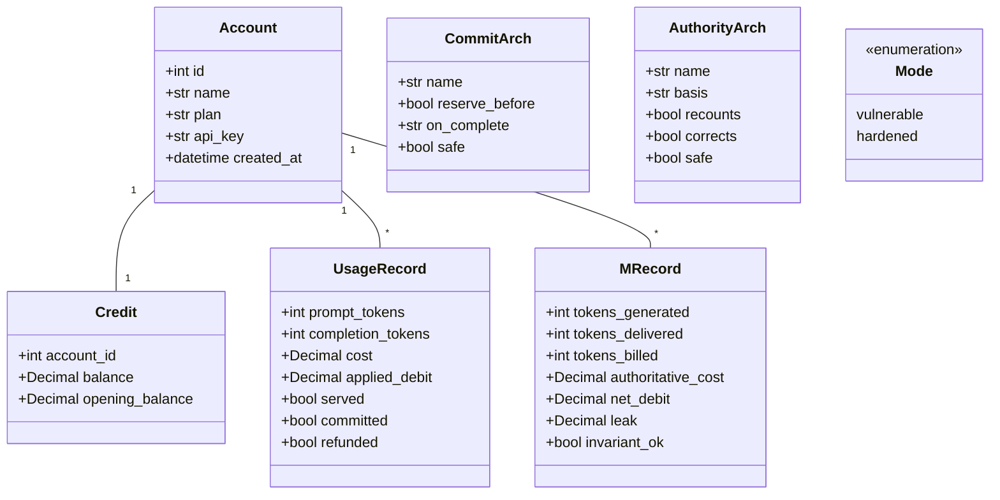

### 6.2 Object Diagram — one M2 trial instance

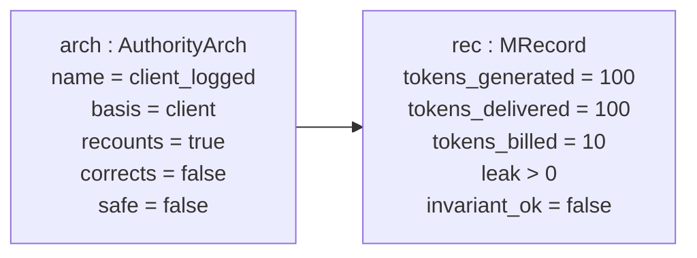

This object diagram is the M2 result in miniature: `recounts = true` but `corrects =
false` — the server computed the usage correctly and still billed the declared number.

## Output / Result
A class diagram covering the ORM entities and the two architecture descriptor classes, and
an object diagram instantiating the `client_logged` failure case.

## Learning Outcome
Learned to model a system honestly when it is not uniformly object-oriented, rather than
forcing procedural code into invented classes.

## Precautions / Assumptions
**Not separately implemented as classes in the current testbed:** the metering, pricing
and debit logic (`app/metering/`) is procedural. It is represented in the structured chart
(Experiment 3) instead of being given fictitious class structure here.

---
---

# Experiment 7

## Aim
Draw the behavioural view diagram: State-chart diagram and Activity diagram.

## Apparatus / Software Requirements
StarUML / Mermaid; `formal/TokenAccounting.tla`.

## Theory
A state-chart shows the states of an object and the events causing transitions. An
activity diagram shows control flow through an operation.

## 7.1 State-chart — request lifecycle

**MODEL-LEVEL.** These are the twelve states declared in the TLA+ specification
(`formal/TokenAccounting.tla`, line 44), not states invented for this diagram.

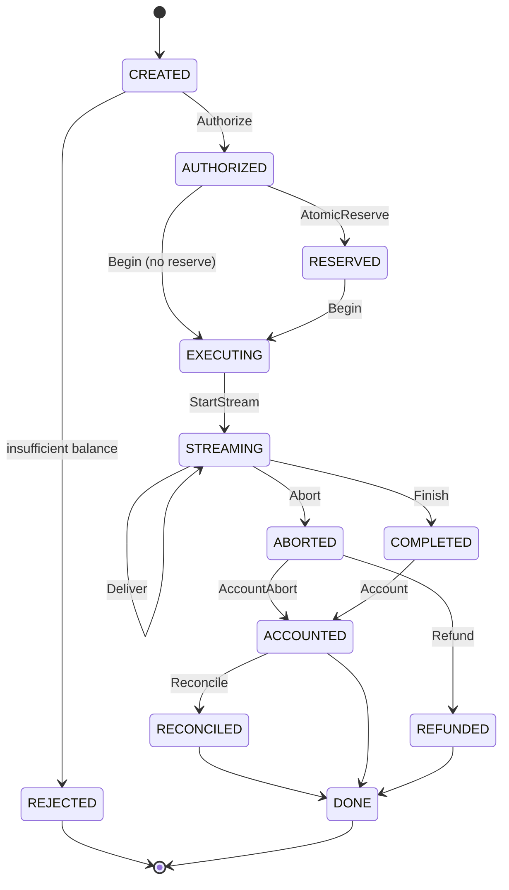

The M1 failure is the `ABORTED → REFUNDED → DONE` path: value was delivered during
`STREAMING`, and the terminal path returns the reservation without accounting for it.

## 7.2 Activity diagram — serve one metered request

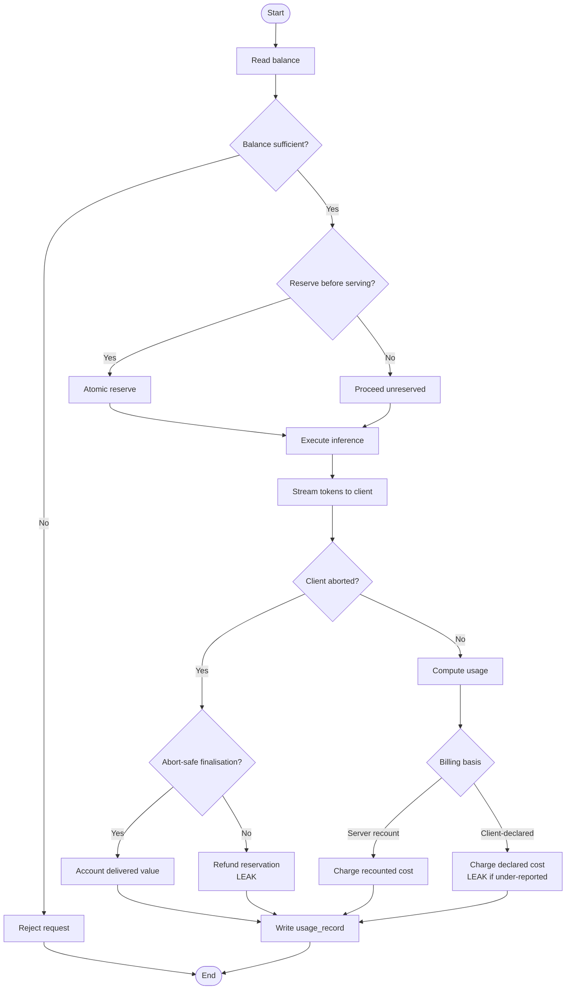

The two nodes marked **LEAK** are exactly the M1 and M2 defects.

## Output / Result
A state-chart using the twelve lifecycle states from the formal specification, and an
activity diagram in which both failure dimensions appear as specific decision outcomes.

## Learning Outcome
Learned that a behavioural model can be made machine-checkable: because these states came
from the TLA+ specification, the same diagram was verified exhaustively rather than only
drawn.

## Precautions / Assumptions
The state-chart is MODEL-LEVEL. The implementation follows the same lifecycle but there is
no mechanised refinement proof from the specification to the code — this limitation is
stated in the research paper and is not glossed over here.

---
---

# Experiment 8

## Aim
Draw the behavioural view diagram: Sequence diagram and Collaboration diagram.

## Apparatus / Software Requirements
StarUML / Mermaid; `app/m_routes.py`, `app/architectures/`.

## Theory
A sequence diagram shows interactions ordered in time; a collaboration diagram shows the
same interactions organised around structural links.

## 8.1 Sequence diagram — M2 usage-authority flow (`POST /m2/complete`)

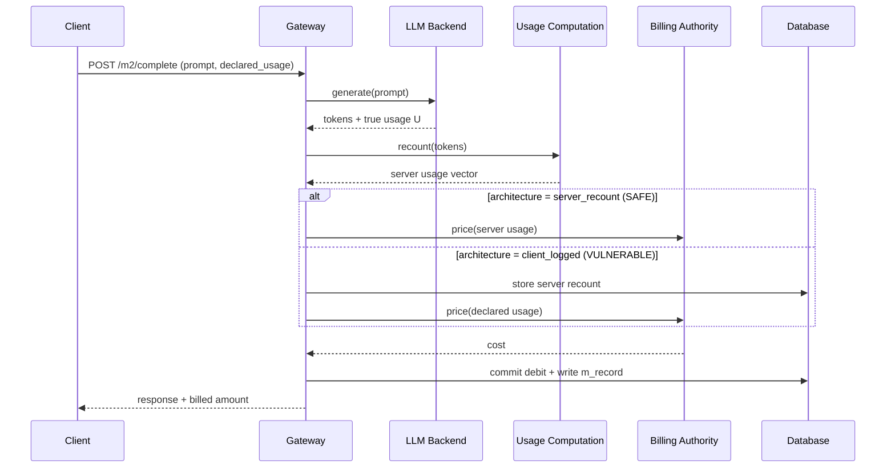

The `client_logged` branch is the counter-intuitive case: the recount is computed *and
stored*, and the charge is still taken from the client's declared number.

## 8.2 Collaboration diagram

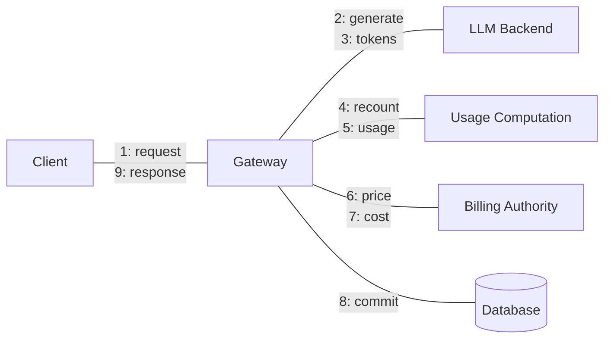

## Output / Result
A sequence diagram showing both the safe and vulnerable billing-basis branches, and the
equivalent collaboration view with numbered messages.

## Learning Outcome
Learned that the ordering in a sequence diagram can itself carry the security argument:
the defect is visible as a message going to the billing authority from the wrong source,
not as a missing step.

## Precautions / Assumptions
The diagram shows the M2 path. The B0 and M1 paths differ and are covered by the activity
diagram in Experiment 7.

---
---

# Experiment 9

## Aim
Perform the implementation view: Component diagram.

## Apparatus / Software Requirements
StarUML / Mermaid; repository tree.

## Theory
A component diagram shows replaceable units of implementation and their interfaces.

## Project-specific work

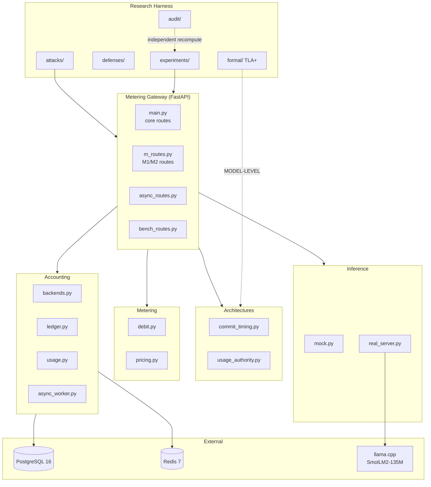

The dashed edges are deliberate: `audit/` imports nothing from the project and re-derives
results independently, and `formal/` verifies the architecture semantics without being
part of the runtime.

## Output / Result
A component diagram of six real subsystems plus three external services, distinguishing
runtime components from research-harness components.

## Learning Outcome
Learned to separate deliverable runtime components from verification components, and to
show independence (the audit path) as an architectural property rather than a claim.

## Precautions / Assumptions
`attacks/` and `defenses/` are research components, not shipped features of a product.

---
---

# Experiment 10

## Aim
Perform the environmental view: Deployment diagram.

## Apparatus / Software Requirements
`docker-compose.yml`, `docker-compose.multiworker.yml`, `docker-compose.distributed.yml`.

## Theory
A deployment diagram maps software artefacts onto execution nodes.

## Project-specific work

The repository contains **three real Compose topologies**, all of which were used in the
cross-architecture validation. No cloud infrastructure is involved; everything runs
locally.

### 10.1 Baseline single-node (`docker-compose.yml`)

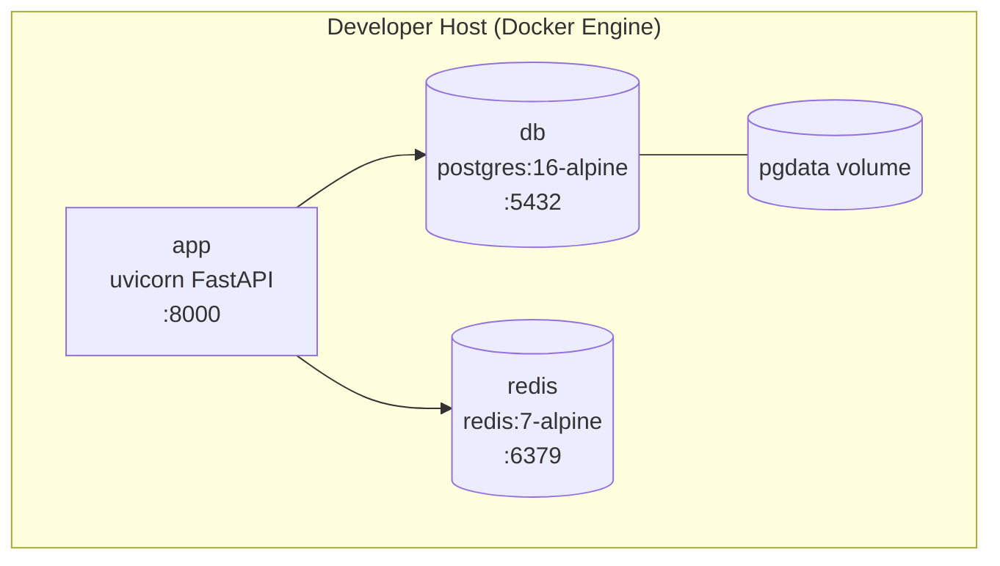

### 10.2 Multi-worker (`docker-compose.multiworker.yml`)

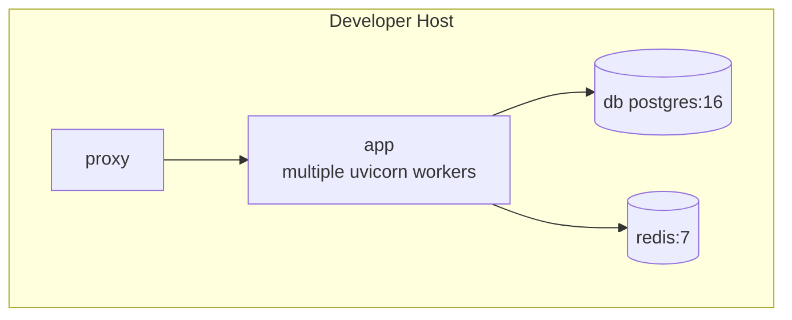

### 10.3 Distributed two-gateway (`docker-compose.distributed.yml`)

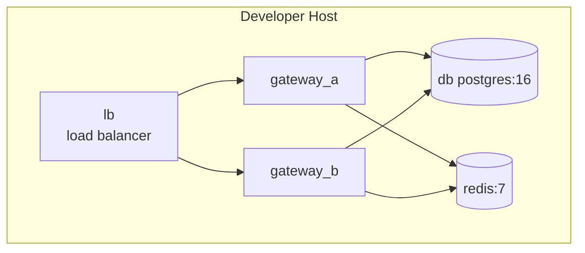

These three topologies exist because the study needed to show that the architectural
conclusions do not depend on execution topology — a single process, multiple workers
behind a proxy, and two independent gateways behind a load balancer all sharing one
database.

## Output / Result
Three deployment diagrams corresponding to the three Compose files actually present in the
repository.

## Learning Outcome
Learned that deployment topology is an experimental variable, not just an operations
concern: running the same accounting logic under three topologies is what makes a
concurrency-related result credible.

## Precautions / Assumptions
**No cloud deployment exists.** All topologies are local Docker Compose. Nothing about
AWS/Azure/GCP is claimed.

---
---

# Experiment 11

## Aim
Perform various testing using the testing tool: unit testing and integration testing for a
sample of the system.

## Apparatus / Software Requirements
Python 3.11+; Docker Compose stack running; `experiments/`, `audit/`, `formal/`.

## Theory
Unit testing exercises a component in isolation; integration testing exercises components
together. Formal verification is a distinct activity — it proves properties over a model
rather than executing the implementation, and is reported separately below.

## Project-specific work

The repository contains three distinct classes of verification. They are **not** the same
thing and are not presented as such.

### 11.1 Integration / regression tests — IMPLEMENTED

These execute the real gateway against the real database.

| Suite | Command | Result |
|---|---|---|
| B0 controls & invariants | `python experiments/regression_class6.py` | **19/19 passed** |
| M1/M2 architecture regression | `python experiments/regression_m.py` | **16/16 passed** |
| Metamorphic properties | `python experiments/metamorphic_checks.py` | **22/22 passed** |

Sample of what `regression_class6.py` asserts (real control conditions):

```
C3 hardened no over-serve                           PASS
C3 hardened no invariant violations                 PASS
C3 hardened reconciled                              PASS
C5 hardened insufficient served==0                  PASS
```

### 11.2 Independent audit — IMPLEMENTED

`audit/` re-derives every reported quantity from raw data using code that imports nothing
from the project, so a bug in the project cannot hide itself.

| Check | Command | Result |
|---|---|---|
| Full recomputation | `python audit/recompute_all.py` | **0 discrepancies** (420 B0 trials + M1/M2 corpus) |
| Independent M2 model | `python audit/m2_independent_check.py` | **0 mismatches** |

### 11.3 Formal verification — MODEL-LEVEL, *not* unit testing

`python formal/check.py` runs the TLC model checker over the TLA+ specification.

```
configurations : 10   checks (config x invariant): 40
distinct states explored (total): 27,526
matched expectation : 40/40
DISAGREEMENTS       : 0
```

The four invariants checked are `AccountingIntegrity`, `Solvency`, `LedgerConservation`
and `RefundBounded` (plus `TypeOK` as a type check). Every expected outcome is declared in
the checking script *before* the run, and the script exits non-zero on any disagreement.

**This is exhaustive state-space exploration of a finite model, not execution of the
implementation.** It is reported here because the lab manual asks for testing, but it is
explicitly not a unit test.

### 11.4 Fault injection

The integrity gates are validated adversarially: corrupting a leak value causes the gate
to fail the run. A gate that never fails proves nothing, so it was made to fail on purpose.

## Output / Result

```
regression_class6      19/19 PASS
regression_m           16/16 PASS
metamorphic            22/22 PASS
recompute_all          0 discrepancies
m2_independent_check   0 mismatches
TLC                    40/40 expectations, 27,526 states, 0 disagreements
```

## Learning Outcome
Learned the practical difference between testing and verification: the regression suites
show the implementation behaves correctly on the cases run, while model checking shows a
property holds over *all* reachable states of a model — and neither substitutes for the
other.

## Precautions / Assumptions
- **Not separately implemented:** there is no `pytest` unit-test suite of isolated
  functions. Verification is at the integration, audit and formal levels. This is stated
  rather than disguised by relabelling integration tests as unit tests.
- The formal model is finite (2–3 concurrent requests, 2 value chunks) and checks safety
  properties only.

---
---

# Experiment 12

## Aim
Perform estimation of effort using Function Point (FP) estimation.

## Apparatus / Software Requirements
Calculator; repository inventory.

## Theory
Function Point analysis sizes software from its externally visible functionality —
External Inputs (EI), External Outputs (EO), External Inquiries (EQ), Internal Logical
Files (ILF) and External Interface Files (EIF) — weighted by complexity, then adjusted by
fourteen General System Characteristics.

## Project-specific work

### 12.1 Counting from the actual system

The gateway exposes **31 distinct routes** and persists **7 tables**. Classification:

| Type | Count | Weight (avg) | FP | Basis |
|---|---|---|---|---|
| **EI** — External Inputs | 14 | 4 | 56 | State-changing POSTs: `/complete`, `/m1/stream`, `/m2/complete`, `/admin/config`, `/admin/accounts`, `/admin/accounts/{id}/reset`, `/admin/accounts/{id}/topup`, `/admin/trials`, `/admin/trials/{id}/finalize`, `/admin/m-trials`, `/admin/m-trials/{id}/finalize`, `/admin/reset-db`, `/admin/accounting-backend`, `/async/b0/complete` |
| **EO** — External Outputs | 4 | 5 | 20 | Derived/computed outputs: `/admin/trials/{id}/audit`, `/admin/m-trials/{id}/audit`, `/admin/quote`, `/admin/async/worker/stats` |
| **EQ** — External Inquiries | 6 | 4 | 24 | Retrieval without derivation: `/health`, `/admin/db-info`, `/admin/config` (GET), `/admin/accounts/{id}`, `/admin/async/state`, `/bench/engines` |
| **ILF** — Internal Logical Files | 7 | 10 | 70 | `accounts`, `credits`, `ledger_entries`, `trials`, `usage_records`, `m_trials`, `m_records` |
| **EIF** — External Interface Files | 2 | 7 | 14 | llama.cpp serving endpoint; Redis keyspace |
| | | **UFP** | **184** | |

### 12.2 Value Adjustment Factor

Fourteen GSCs rated 0–5 against the actual system:

| GSC | Rating | Justification |
|---|---|---|
| Data communications | 4 | HTTP + streaming SSE, DB, Redis |
| Distributed processing | 4 | three real deployment topologies |
| Performance | 4 | latency/throughput measured to microsecond resolution |
| Heavily used configuration | 2 | laptop-class hardware by design |
| Transaction rate | 3 | concurrency sweeps to 50 |
| Online data entry | 2 | API only, no UI |
| End-user efficiency | 1 | no end-user interface |
| Online update | 5 | atomic balance updates are the core subject |
| Complex processing | 5 | multi-category pricing, reconciliation, formal model |
| Reusability | 3 | architectures are pluggable descriptors |
| Installation ease | 4 | single `docker compose up` |
| Operational ease | 3 | admin endpoints, reset, drain |
| Multiple sites | 2 | multi-node Compose only, no real multi-site |
| Facilitate change | 5 | posture switchable at runtime without restart |

ΣGSC (Total Degree of Influence) = **47**

```
VAF = 0.65 + (0.01 × 47) = 0.65 + 0.47 = 1.12
AFP = UFP × VAF = 184 × 1.12 = 206.08 ≈ 206 Function Points
```

### 12.3 Effort estimate

Using a nominal productivity of **12 FP per person-month** for research-grade software
with formal verification and an experimental harness:

```
Effort = 206 / 12 ≈ 17.2 person-months
```

## Output / Result

```
UFP  = 184
ΣGSC = 47
VAF  = 1.12
AFP  = 206 Function Points
Estimated effort ≈ 17 person-months (single developer, nominal productivity)
```

## Learning Outcome
Learned to size a system from externally visible functionality rather than lines of code,
and that the adjustment factor is where domain judgement enters — "complex processing" and
"online update" dominate here because the correctness of a balance update *is* the
research subject.

## Precautions / Assumptions
- **Complexity weights are average-tier throughout.** Per-transaction DET/RET analysis was
  not performed, so the count is defensible but not fine-grained. This is stated rather
  than presented as a precise figure.
- The productivity constant (12 FP/person-month) is a **nominal planning figure**, not a
  measurement of this project. The resulting effort figure is therefore an estimate and
  should not be read as the actual time spent.
- The research harness (`attacks/`, `experiments/`, `audit/`, `formal/`) is **excluded**
  from the FP count, since FP sizes delivered application functionality rather than
  verification scaffolding.

---
---

# Experiment 13

## Aim
Prepare a timeline chart / Gantt chart / PERT chart for the selected software project.

## Apparatus / Software Requirements
Mermaid / any Gantt tool; repository history.

## Theory
A Gantt chart shows activities against time; a PERT chart shows task dependencies and the
critical path.

## Project-specific work

The phases below are the project's **actual** phases, recoverable from the repository
structure and release documents. Durations are shown in relative weeks, because exact
historical start dates for each phase are not recorded in a form this file can cite
reliably.

### 13.1 Gantt chart (relative timeline)

```mermaid
gantt
    title Token-Accounting Integrity — Project Phases (relative weeks)
    dateFormat  X
    axisFormat  W%L
    section Definition
    Problem definition & threat model      :a1, 0, 2w
    Literature / novelty audit             :a2, after a1, 2w
    section Build
    Testbed & gateway (Phase 0)            :b1, after a2, 3w
    B0 baseline reproduction               :b2, after b1, 1w
    M1 / M2 architectures                  :b3, after b2, 3w
    section Measure
    Attack harness & experiments           :c1, after b3, 3w
    Defence implementation & overhead      :c2, after c1, 2w
    Cross-architecture & async validation  :c3, after c2, 2w
    Real serving-stack validation          :c4, after c3, 1w
    section Verify
    TLA+ specification                     :d1, after b3, 2w
    TLC model checking & counterexamples   :d2, after d1, 2w
    Independent audit & regression         :d3, after c4, 2w
    section Publish
    Manuscript preparation                 :e1, after d3, 3w
    Artifact packaging & archival          :e2, after e1, 1w
    Submission                             :e3, after e2, 1w
```

### 13.2 PERT — dependencies and critical path

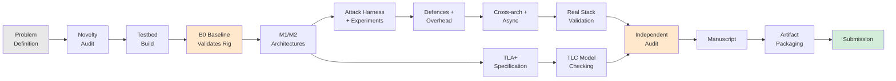

**Critical path:** Problem Definition → Novelty Audit → Testbed → B0 Baseline →
M1/M2 Architectures → Attack Harness → Defences → Cross-architecture → Real Stack →
Independent Audit → Manuscript → Packaging → Submission.

The TLA+ branch (G→H) runs in parallel with the empirical branch and rejoins at the
independent audit. **B0 Baseline** is on the critical path despite not being a
contribution, because nothing downstream is trustworthy until the measurement rig is
validated against a known result.

## Output / Result
A phase-level Gantt chart and a PERT network with an identified critical path, both
derived from the project's real phase structure.

## Learning Outcome
Learned that verification work can be scheduled in parallel with implementation, and that
a task with no deliverable value (reproducing a known baseline) can still sit on the
critical path because it establishes the validity of everything after it.

## Precautions / Assumptions
- **Durations are relative, not historical.** Exact per-phase calendar dates were not
  recorded during the project, and inventing them would misrepresent the record.
- The single confirmed calendar fact is the submission date to *Computers & Security*
  (25 August 2026), which is documented in the repository.

---
---

## Summary of evidence used

| Experiment | Primary repository evidence |
|---|---|
| 1 | `README.md`, research problem statement |
| 2 | `app/` module tree, `app/config.py`, formal invariants |
| 3 | `app/` structured module hierarchy |
| 4 | `app/models/models.py` — 7 ORM tables |
| 5 | 31 API routes across `app/main.py`, `m_routes.py`, `async_routes.py`, `bench_routes.py` |
| 6 | `app/models/models.py`, `app/architectures/*.py` |
| 7 | `formal/TokenAccounting.tla` — 12 lifecycle states |
| 8 | `app/m_routes.py`, `app/architectures/usage_authority.py` |
| 9 | full repository component tree |
| 10 | three `docker-compose*.yml` files |
| 11 | `experiments/regression_*.py`, `experiments/metamorphic_checks.py`, `audit/*.py`, `formal/check.py` |
| 12 | route inventory (31) and schema inventory (7 tables) |
| 13 | repository phase structure and release documentation |
